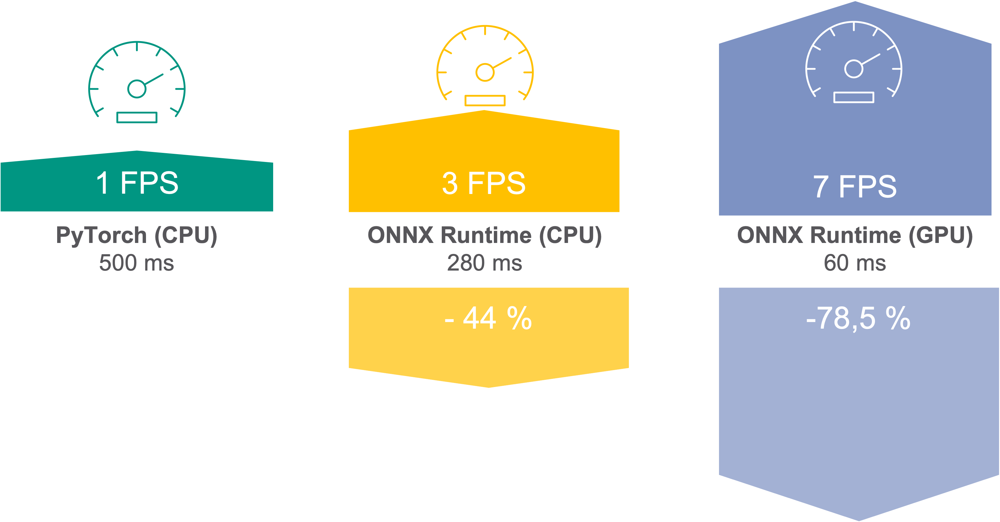
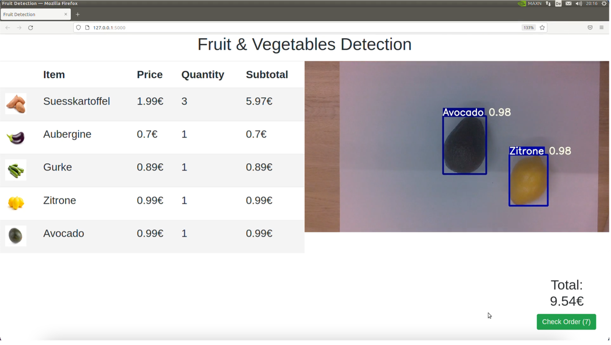
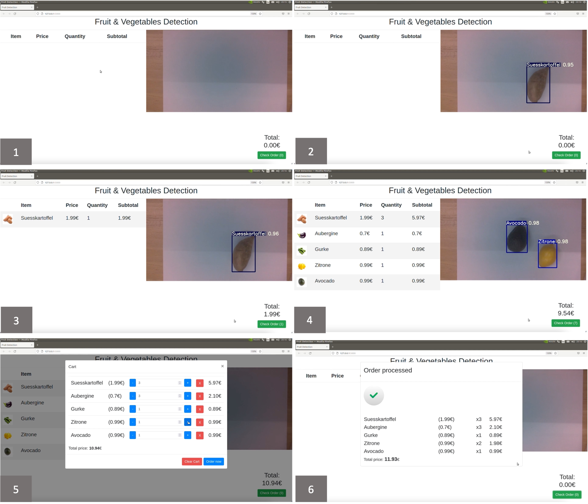

# Technical Implementation

 
## Overview

As mentioned in the former section, we used the YoloV5 architecture for our object detection task. We utilized the comprehensive repository from [ultralytics](https:/github.com/ultralytics/yolov5), which already provided the necessary tools to get us started. As this repository used PyTorch, this was a key dependency for us. Furthermore, to get the video stream from the CSI-camera from the Jetson Nano we used a combination of Gstreamer and OpenCV, which allowed us to run our inference with Yolo framework on each recorded frame.


In order to present the respective results, the frame that was used for inference was augmented with the bounding boxes around the detected objects with the respective classes and scores.

As this detection was only one part of our solution, we passed the augmented frame to a webpage where our results were presented in a user-friendly frontend, which was built using JavaScript and Bootstrap. The communication between the Python backend and the webpage was managed by a combination of Flask and SocketIO.


_Figure 6: Techstack_

Furthermore, we speed up our inference time using the ONNX runtime engine. An overview of our techstack is summarized in Figure 6

  
## Inference time optimization

We first started out using vanilla PyTorch on the CPU for our inference, which turned out to be rather slow as the inference time for one image already took 0,5 seconds, so we could only run our videostream at 1 Frame per second (FPS). As we already used the nano version of the yolo architecture, so the smallest version of the CNN available, we had to find other ways to improve our inference speed. The final solution that we came across was the ONNX runtime engine, an open-source project which is specifically designed to accelerate the machine learning process, in particular the inference step.

We implemented the ONNX runtime engine by utilizing the [yoloRT](https://zhiqwang.com/yolov5-rt-stack/) repository, which made it particularly easy to transform an already existing model in the PyTorch format to the ONNX format. The main simplification provided by this repository is that the transformation of the model format also respects changes that are necessary to use the inference using the ONNX runtime engine in a way that further augmentation of the results is not necessary, like preprocessing the shape of the processed image for a correct display of the bounding boxes. Using this solution, we were able to decrease the inference time by about 44%, from 500ms to 280ms. This allowed us to run our model on 3 FPS, which worked quite well for our solution.

However, this solution still uses the CPU, as we had problems installing the required packages for our Python version with GPU support.

The Jetson nano already comes preinstalled with the most used machine learning libraries, compiled with GPU support, however only for the preinstalled Python version 3.6.9. The repositories that we used required us to use Python 3.8 or higher, so we could not use the preinstalled packages in our environment. When we reinstalled the respective packages from PyPi, all of them only supported the CPU or had to recompiled from source with GPU support enabled.



_Figure 7: Inference time speed-up_

Regardless of these restrictions, with the help of group 2 we found a prebuilt Python wheel for the ONNX runtime engine with GPU support, which could be downloaded and easily installed into our environment. By utilizing the GPU, we could gain a massive improvement of again reducing our inference time by 78.5% down to 60ms, which allowed us to run our model 7FPS. A summary of the inference time improvements is shown in figure 7.

## Backend

As mentioned above, we implemented a web application with the microframework Flask. We opted for Flask because, as a microframework, Flask has no or only few dependencies, which makes it lightweight and secure. It is widely used (Netflix, Airbnb…) and the industry standard in Python when it comes to doing nearly anything with HTTP Protocol in Python. 

In our “app.py” we create a flask app and a Flask-SocketIO server and run the SocketIO web server with the flask app instance as a parameter. By default, the server listens on the localhost (127.0.0.1.) with port number 5000.  

We defined two endpoints <code>‘/’</code> and <code>‘/video’</code> to handle HTTP GET requests. The <code>‘/’</code> endpoint renders the index.html file, which is the view the cashier sees. <code>‘/video’</code> returns a Response object whose response is the augmented frame of the OpenCV video stream. The server uses the <code>multipart/x-mixed-replace</code> HTTP header to push dynamically updated content to the web browser. It works by instructing the browser to keep the connection open and replace the displayed web page or piece of media with another when it receives a special token (defined with boundary). This is how the video is streamed to the browser. 

```
@app.route('/')
def index():
    return render_template('index.html')

@app.route('/video')
def video():
    return Response(generate_frames(),mimetype='multipart/x-mixed-replace;boundary=frame')
```

For each frame it is documented which product category (e.g. lemon) and how many objects <code>count</code> of this category were detected. It is also recorded for how many frames <code>since_frames</code> a certain number of products of a category have been detected. 

```
{
    "objects":
    {
      "zitrone":
      {
        "count":1,
        "since_frames": 1
      },
      "suesskartoffel"
      {
        "count":2,
        "since_frames":8
      },
    }
}
```


A product needs to be detected for a certain number of consecutive frames in order to be added to the shopping cart. The duration in which an item must be detected to be added to the shopping list is determined by two components: First, the framerate and second, the number of frames threshold (we set it to 11 Frames). If the threshold is reached and a product is detected for 11 frames, a server generated SocketIO event is emitted to the connected client. This is how changes are communicated between backend and frontend. 

## Frontend

We added a user-friendly frontend to our Grocery Vision prototype in order to demonstrate the functionality in a real-life way.



The figure shows the frontend the cashier sees at the POS checkout screen when using Grocery Vision. On the left side of the screen, the shopping list is displayed with all necessary information such as item name, picture, price, quantity and the calculated subtotal. On the right side of the screen, the video stream from the jetson nano’s CSI camera is displayed. In the bottom right corner, the total sum of the current purchase is shown as well as there is a green button that allows the cashier to complete the purchase.  

Text BoxAll the cashier has to do is to put the item in front of the camera. After a certain number of frames in which the item is detected, it is added to the shopping list on the left side of the screen. For getting updates the frontend subscribes to the SocketIO connection <code>‘detected_objects’</code>, which returns a dictionary of the following kind:  

```
{
  label: "zitrone"
  report: {
    zitrone: {
      count: 1,
      since_frames: 11
    }
  }
}
```

In this dictionary, the item (here: label = lemon) and its quantity (here: count=1) that needs to be added to the shopping cart is given. The updates of the shopping cart and its visualization is handled with JavaScript. 



This figure shows the process of a purchase, where picture (1) shows the starting screen. In (2) the first product (sweet potato) is put in front of the camera. After the sweet potato is detected during a certain number of frames, it is added to the shopping list (3). The cashier continues like this and moves on to the next products. After the last products are put in front of the camera (4) the cashier clicks on the green “check order” button to check out the order. In a final step the cashier can now do adjustments to the order before completing the purchase so that the order is processed (6). 

  
## Issues and Learnings


_Figure 8: Main compatibilityissues_

As in every project we came across multiple issues, however most of them can be summarized under &quot;Compatibility issues&quot;. A short overview is given in figure 8.

As mentioned in the last section, we had trouble installing the necessary packages with GPU support, since due to our dependencies we were required to use Python 3.8 or newer, however the preinstalled packages with GPU-support that came with the Jetson Nano could only be used with Python 3.6.9. If the packages were installed via pip, the corresponding packages only had CPU support.

Moreover, at the beginning of our project we started developing a solution on our personal computers that accessed the webcam of a computer via JavaScript, however when we deployed the solution on the Nano, we realized that solution does not work, as the used CSI-Camera was not detected as a webcam. Since we did not find an appropriate solution to this problem, we had to start over with a new solution.

The main learning we took from this is that we want to increase our use of OS agnostic software solution like Docker, in order to prevent these mistakes from happening again.


