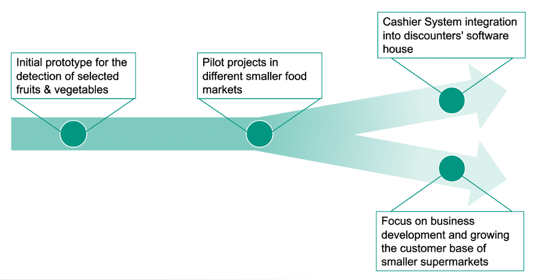

# Business Strategy

## Industry Expertise

Since our group had no prior experience in the supermarket industry, we decided to reach out to different industry experts. Not only did we contact many supermarket and discounter chains, but also a variety of POS-System providers. To our advantage, we received a reply from Manfred Kiffe, the managing director of PROCOM iPOS Systems GmbH, who told us that he would be happy to share his 30 years of know-how with us. In preparation for this telephone interview, we decided to formulate some questions we would like to get answered:

**Presentation of our idea/solution**

In general, Mr. Kiffe found our idea very good, and he mentioned a few times that we should not be discouraged. Beforehand we sent him a demo video so that he could get a better understanding of how our solution works. His opinion was that we came up with an innovative idea that could have a lot of potential. He also said that he had contacts to innovative partners that he could put us in touch with and that we could also contact the development department of his company that programs the POS software. Furthermore, he also told us to keep him informed about the development of our project and to contact him again if we have any questions.

**Overall potential of our solution**

Mr. Kiffe believed our solution could be successful in the medium to long term. For large chains (Edeka, Rewe) our solution would be attractive if we have a low error rate in our model. He said that in the supermarket industry the margins are very low and really attention is paid to every possible saving. Therefore, our solution would be relevant for the big chains if we could actually present a cost benefit, such as staff savings in the long run. Possible difficulties for us that he had mentioned were, among others, that the big chains like Edeka already have their own internal software houses that research innovative ideas long in advance of the actual implementation. He said that POS-Systems have an average life span of about 7 years and the contracts with the POS-System manufacturers are made well in advance. As a second hurdle, he said that in his eyes &quot;banal&quot; innovations take a very long time to appear on the market and are then also partly taken off the market again due to too high error rates. As an example, he had mentioned the voice output at the cash register, which e.g., says out loud the amount of change for the hearing impaired. Or also that many stores have partially implemented the self-service checkout, but since with this too often still employees had to intervene, were dismantled again. For these reasons, he felt that it might take a very long time for our solution to appear on the market.

**Is our idea with the interface to the POS-Software and the scale at all feasible?**

Regarding the interface Mr. Kiffe shared a lot of valuable information. First, he told us that it is quite difficult to create an interface directly to the scale. In order to use the scale directly, we would need a certification in Germany, which is issued by the Federal Physical-Technical Office in Braunschweig. This process is very complex and not even all POS-System manufacturers have such a certification. He also informed us that there is a whole guide which describes what is allowed and what is not (Welmec-Guide). Additionally, in stores that have such a certification, every 2 years the calibration office comes by and looks whether the scale still measures accurately. As this process is quite complex some supermarkets, especially the smaller ones, have no integrated scales in the cash registers. This is then also the reason why in some supermarkets customers must weigh the fresh goods themselves, as these stores do not have checkout systems with integrated scales. Therefore, he said that it is theoretically possible for us to create such an interface directly to the scale, but it could be associated with a lot of work. Instead, he presented a clever alternative. He said we could bypass this certification process if we do not create the interface directly to the scale, but to the POS software, which already has the certification in the ideal case.

**Would an integration of our solution into existing POS-Systems be at all possible?**

For the integration, Mr. Kiffe was of the opinion that it would make more sense in the first step to decouple the camera software and POS-System software, since this would avoid complications with the different operating systems. As a second step, or long-term solution, he said a direct integration into the POS system would be the optimal solution. However, this would require the POS-System provider to manufacture a system with an integrated camera.

**Do the POS-Systems have a GPU that would be capable of running a machine learning model?**

Mr. Kiffe said that the absolute top model has an i5 processor. However, this is not the standard. He informed us that most POS-Systems have an Intel J1900 or i3 processor. Therefore, GPU performance is very low. He also said that processes that are taken for granted by customers, such as contactless payments, sometimes push the POS system to the limit, since the WIFI connection in the stores is often not outstanding. On a side note, he also mentioned that a scanner scale costs about 2000€ and the associated cash POS-System another 2000€. This means that if a supermarket has several cash registers, this is a very large investment, especially for the smaller stores.

## Learnings

With the help of our expert interview, we were able to gain many insights. The interview enlightened us that some of our original ideas were good in theory, but not feasible in practice. Initially, we planned to run our model either via a cloud-based platform or via the hardware of the POS system. However, we were told otherwise: firstly, the Internet connection would not be strong enough to run a cloud-based platform, and secondly, the built-in hardware would not be able to run our model.

## Benefits

We want to conclude the business case with the gains that our application brings to the different business ecosystem participants. Our service has several benefits that can be attributed to the different players in the business platform we have created.

Let&#39;s first take a look at the supermarkets. Since they are the main customers or users of our supermarkets, they are the focus. In supermarkets, it is much easier to train new employees and the time required to do so can be shortened. This means that employees are ready to work faster, make fewer mistakes, especially in the initial phase, and therefore have higher productivity. And consequently, this leads to a reduction in personnel costs.

Another actor we have already introduced is the supermarket visitor or customer. The actual supermarket visitor or customer can go through the checkout faster and does not have to scan or weigh their products themselves. Compared to other checkout systems, this is a significant advantage and the customer experiences a much faster checkout. simply a simpler customer journey.

And finally with the last of the 3 players in our business ecosystem, the POS system provider. The POS system provider that would benefit from an integration of our service to have a clear advantage over their competitors with a sophisticated POS system. The main advantage is that the purchase of products can be handled without labeling or PLU codes. And the additional point is that it can easily adapt to changes in the product range.

## Future Business strategy

Regarding the further development and implementation of Grocery Vision, we would have to decide on the future direction. In the meeting with the industry expert, Mr. Kiffe informed us that there are two potential future paths we could take. Figure 5 illustrates this crossroad.

_Figure 5: Future Business Strategy_

The first path would be to try and make Grocery Vision a lucrative investment for one of the big supermarket chains. This means that we would be integrated into their own software development department. Therefore, instead of competing against a giant competitor we could collaboratively innovate our solution with the resources of a big company.

However, as this path could be difficult to reach, we could also try the second path. The second path would be to further develop Grocery Vision on our own. And instead of focusing on the big supermarket chains as potential customers, we would try to sell our solution to smaller independent stores. The advantage of this path would be that we would remain independent, i.e., we would continue to make our own strategic decisions in the future.

