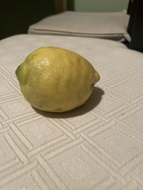

# Data Generation

To gather sufficient data for training, we decided to create the data synthetically. Synthetic generation of training data allows us to create a large amount of data in a short time and allows for fast adaptability to new vegetables and fruits. Also, annotations can be stored at the same time as the picture is created. It is not necessary to manually label the pictures.

  
## Data Creation

For the realization of our proof-of-concept we decided to use a limited number of vegetables and fruits. The concept of creating synthetic data relies on using a random picture and printing the items that the model must detect on them.

In our case, one of 60 random background images served as the basis for the synthetic images. Since more than thousand images must be created for our training, 60 background images did not provide enough variety. Our initial tries revealed that adding additional noise to the background of the image improved the model&#39;s accuracy. Therefore, we added another step that modifies the background before placing the fruit and vegetable items on the background. We made use of a collection of random objects such as cars, screwdrivers, chairs, etc. which were randomly placed on the background. We also made sure to add hands to our collection of noise items. Adding a high number of noise items to the background ensures that the background of each image is unique.

We limited the model to detect only a handful of fruits and vegetables:

| Eggplant | Avocado | Cucumber | Sweet Potato | Lemon |
| --- | --- | --- | --- | --- |
| {width=115} | {width=115} | {width=115} | {width=115} | {width=115} |

We took 30 to 40 pictures for each vegetable and fruit class. Most of the pictures were taken by us. In a second step, we used an image editing program to cut out the individual objects to get rid of the background. Some images were used from the &quot;Fruits360&quot; Dataset from Kaggle.com. The cut-out elements were then randomly placed on the background images after applying modifying the background with noise items. To improve the class predictions of our model, we randomly rotate and resize each object before placing it on to the picture. We also allow overlapping of up to 10%. Overlapping ensures that the model detects the vegetables early, even if there are still hands covering the vegetables or fruits or the vegetables and fruits cover each other to a certain degree. Our final images that we used to train our model had about 1-5 vegetable and fruit objects

The images we used to create our synthetic data can be accessed [here.](https://drive.google.com/drive/folders/1I6pUovgsugu6mKjATuBTfGWS__Y3UDxg?usp=sharing)

  
## Labelling

The location of an item plotted on the image is randomly chosen and stored to a text file at the same time. Since we are training a Yolo model, the format in which class and location information is stored to the corresponding conventions.

## Our final dataset

By creating synthetic images, we can assume that we have avoided making man-made errors like grouping, positioning or selection are bypassed. However, we cannot exclude that our generated images are not completely unbiased. The way we captured images and cropped the objects is a key element for creating our data. Errors on this level can have a strong impact on the synthetically generated images.

Our final dataset consisted of 7000 images which we split into 80% training data and 20% test data.

## Possible Extensions

**Introducing new objects**

Introducing new elements is a challenge for our model. To add new objects to the model we would use transfer learning. This is done by transferring the learning progress of the existing model to the new one. This results in advantages such as faster creation, better model quality and less resource usage.

**Improving the model**

Furthermore, our model can be improved by active learning. In active learning mode, every object detection that is not recalled by the cashier is perceived as correct. Any object detection that is recalled by the cashier is perceived as false. This mode requires special attention from the cashiers. However, if our system is used in large supermarket chains, the effort would be very limited, due to having only a few cashiers work in active learning mode for only a few hours creates large amount of data. The amount of additional training data that would be generated would quickly improve the models with little effort.

## Learnings

**Background Noise**

We started generating our data by just using the 60 backgrounds randomly and adding the items that had to be detected by the model. Creating large amounts of data without adding further noise to the background does not provide enough variety to the picture for the model to learn the item classes well. Adding additional noise items helps to create a unique background each time and improves the model&#39;s performance.

**Cut Out**

Cropping out images is error prone. Most of us used the &quot;Preview&quot;-App from the Mac to cut out the objects from the original picture. The &quot;Preview&quot;-App offers different tools for that task. There are two main features that we used in the beginning:

- _Intelligent Lasso_

The intelligent Lasso helps the user to cut out objects, by only having to draw a rough outline around the object.

- _Magic wand_

The magic wand works color based. The user sets a start point on the picture and the software adds pixels to the mask based on the degree that the user defines. Magic wand works best if there is a strong contrast between the subject that has to be cut out and the background (e.g.: eggplant on a white background).

Although the magic wand is the easier tool to use, it caused problems. Oftentimes pixels far outside of the actual objects were also added to the mask.

Since it was mostly just a few pixels and not a larger area we did not see it at first and came across this issue at a very late stage of the project. The problem with this is that the bounding box is drawn too large, and the quality of the model is compromised. (See Figure below)

| Cut Out | Example picture |
| --- | --- |
|  |  |

**Image variety**

As for everything in machine learning, it is true that the model is only as good as the data that is used to train the model. We started with only a few images per class and quickly noticed that there was not enough variety in the original images of objects that we created for generating our data. E.g.: initially we had a red bell pepper in our data set. All the bell pepper pictures that we used for training had a white reflection somewhere on the skin. The model did perform well on the synthetic test data. When used in the development process, the model detected bell peppers more frequently even if no peppers were shown. Our guess is that the model was overfitted due to the white reflection that every original bell pepper image had.