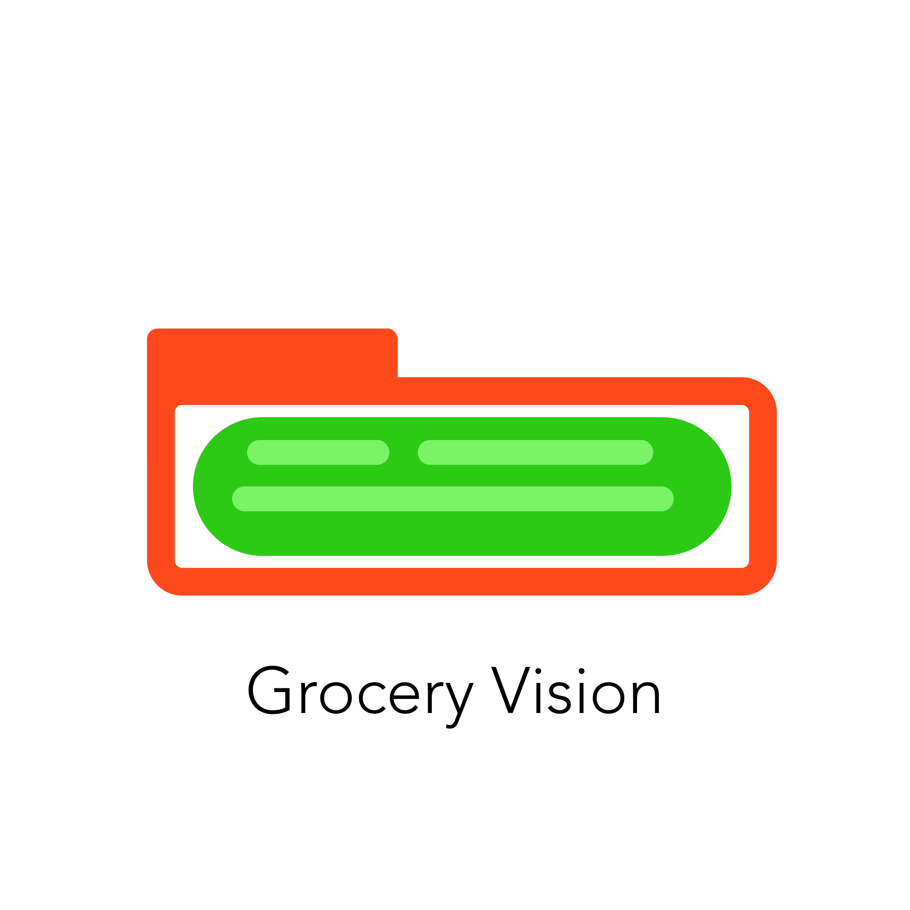
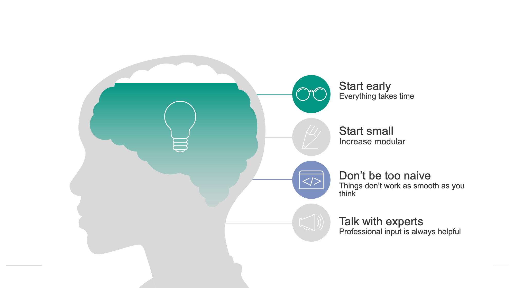

# Welcome to Grocery Vision {width=80}

As disclaimer, the full documents and data are stored in the following repository.

[Documentation](https://git.scc.kit.edu/aiss-cv-projekt/aiss-cv-group3-project/-/blob/main/documentation/Documentation_Grocery_Vision.docx){ .md-button }
[Data and Code](https://git.scc.kit.edu/aiss-cv-projekt/aiss-cv-group3-project){ .md-button .md-button--primary }

## A virtual demonstration of the application
Since in this form of documentation we can show a video, but not a real application, we have prepared just that. The video should simulate the process of shopping in a supermarket. We deliberately paid attention to the sequence of movements and the direction in which the products are passed.

## The Project: Grocery Vision
Grocery Vision is a computer vision application that simplifies the grocery checkout process. What does &quot;simpler&quot; mean? By simpler, we mean that users don&#39;t have to scan labels or memorize PLU codes.

We believe that computer vision, or more specifically object detection in this process, can be a solution to this problem because it provides a real-time way to detect objects in a variety that humans can only achieve after a long training period. However, in natural products such as in the fruit and vegetable department, there are also different shapes and colors, all of which can be assigned to one class and one product. There is a [standard](https://www.verbraucherzentrale.de/sites/default/files/2022-01/verbraucherzentrale-marktcheck-obst-und-gemuese-2022.pdf) that must be followed to sell them as one product, but there remain natural differences between each fruit. Nevertheless, we have chosen this application for our Grocery Vision project.

To clarify the &quot;we&quot; briefly, we are 5 students from KIT who have a great interest in Data Science and software applications. That&#39;s why we all signed up for the AISS Applied in Computer Vision course and had a lot of fun together. We introduce ourselves a bit more detailed here.

In our application, we wanted to simplify the checkout process for products that need to be weighed. Our solution starts at the checkout. As you can see in the image, we use a camera that films a live video of the checkout.

Using the neural network previously trained on synthetic data, our application automatically detects the items and lists them on the screen. The prices from the system are then assigned to the products and processed into the total after the purchase is complete.

Summary of benefits: easier shopping for supermarket customers, shorter training period for new store employees. And POS system providers can offer a centralized solution for weighing and automatic product detection.

## Overall Learnings

We learned a lot on our project journey and would like to share some important lessons with you. First of all, everything takes time and even if the tasks seem smaller, just plan some extra time. Another insight is that you should keep building the project over time. Problems and difficulties will arise, so don't be naive and just take that into account. Finally, talk to industry experts, as they can give you important insights and a different perspective. 

