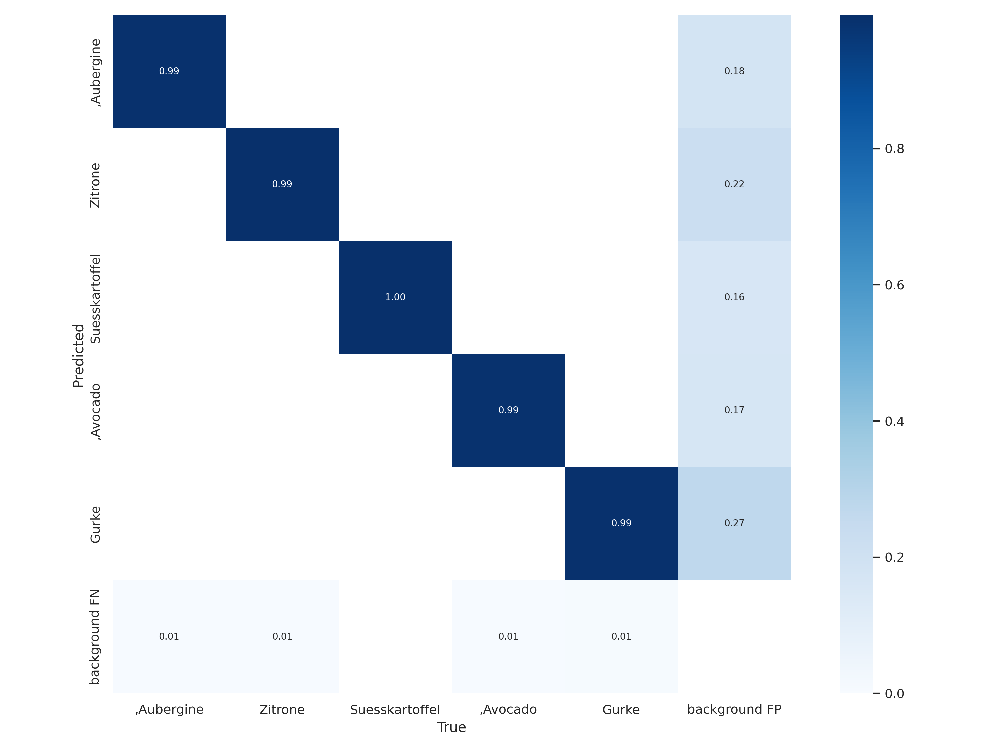

# Model

## Requirements

Our model imposes technical requirements:

- It must be able to detect multiple classes
- It must run in real time
- It must be small enough to run on the Jetson Nano

Our model imposes qualitative requirements:

To measure the quality of our model, we did not focus solely on metrics but rather on satisfying our use case:

_One or more fruit and/or vegetable items are brought into the scene. The objects are included in the POS system if the objects are detected by the model over a certain time period t._

As for specific values we set our goal to detect an item for t =1.5 seconds. If our model does not make any mistakes during the process of a simulated purchase process, we would consider our quality requirement as satisfied.

## Model

Out of the many object detection algorithms, we decided to use the YOLO framework after research. Yolo is based on a CNN structure and detects objects in real time. Because of the CNN structure, the algorithm requires only a single forward propagation in the neural network to detect objects. Furthermore, Yolo detects multiple classes and their bounding boxes simultaneously.

## Training

We trained our model with a [Google Colab Notebook](https://colab.research.google.com/github/roboflow-ai/yolov5-custom-training-tutorial/blob/main/yolov5-custom-training.ipynb#scrollTo=eaFNnxLJbq4J). The resources Google provides were enough for our project. Of the different model sizes, we opted for the smallest &quot;Yolo5n&quot;. We trained our model with a batch size of 16 and an epoch size of 50.

</figure> | <figure markdown>
  
  <figcaption>Figure 11: Confusion matrix of predicted and actual labels</figcaption>
</figure>

</figure> | <figure markdown>
  
  <figcaption>Figure 12: Metrics matrix of our final model</figcaption>
</figure>

After 30 epochs of training (Figure 12), one can already observe a clear approximation of metrics. In the following training up to the last epoch the model is improved even more. After the 50 epochs training the model was tested on the test set with good results. The test set was designed in the same way as the entire dataset and was separated by a train\_test\_split before training. This means that the test ser also consists of purely synthetic generated data. From this, the confusion-matrix shown in Figure 11 was obtained. The number of incorrectly detected objects from other classes is very low on the test set and promises good performance.

