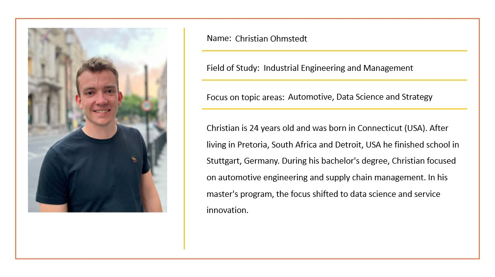
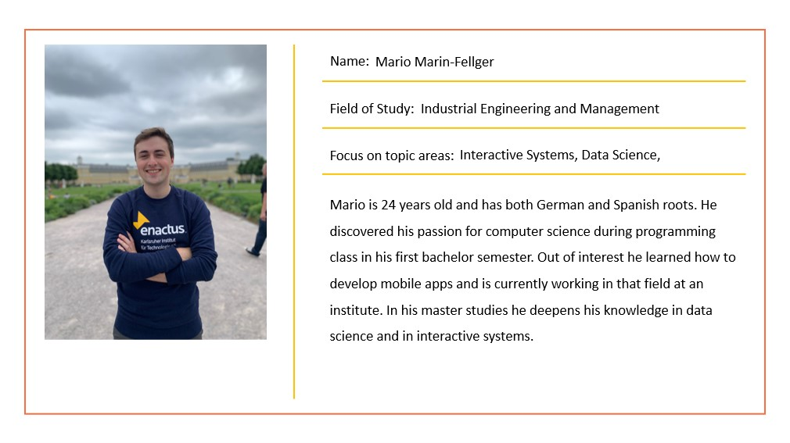
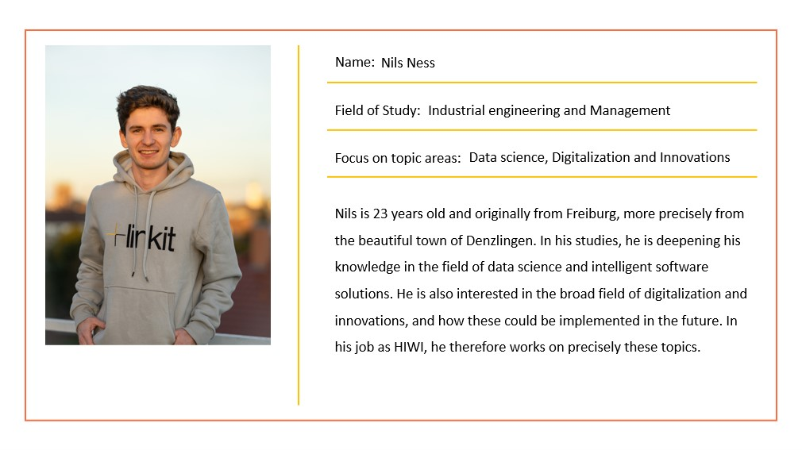
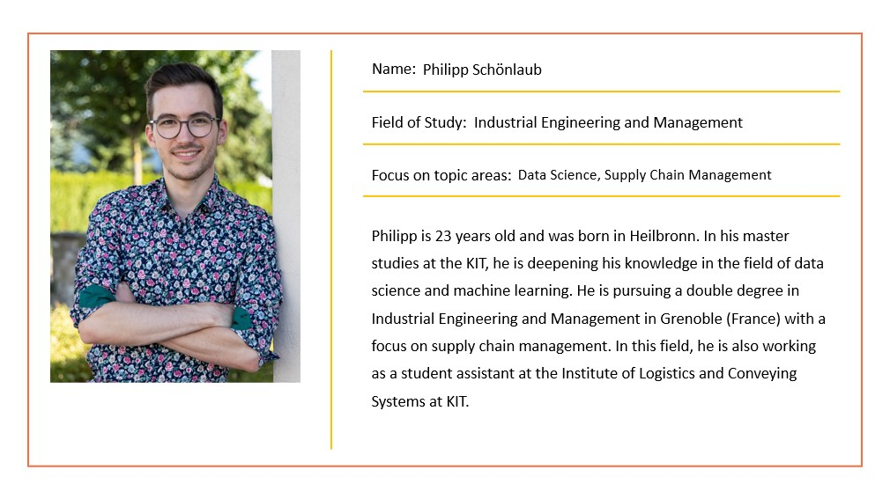
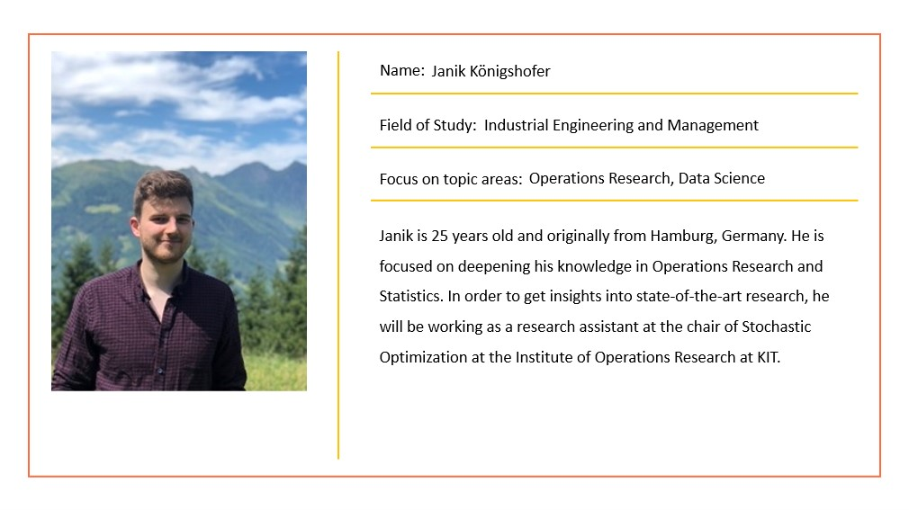

# The Project Team

As some may have noticed, we did this together as a team, but who is on this "team"? 
Our team consists of 5 students from KIT who are all studying industrial engineering in the master's program and actually all started studying at the same time. 
But let's briefly introduce all of them individually.

## Christian Ohmstedt

## Mario Marin-Fellger

## Nils Ness

## Philipp Schönlaub

## Janik Königshofer

